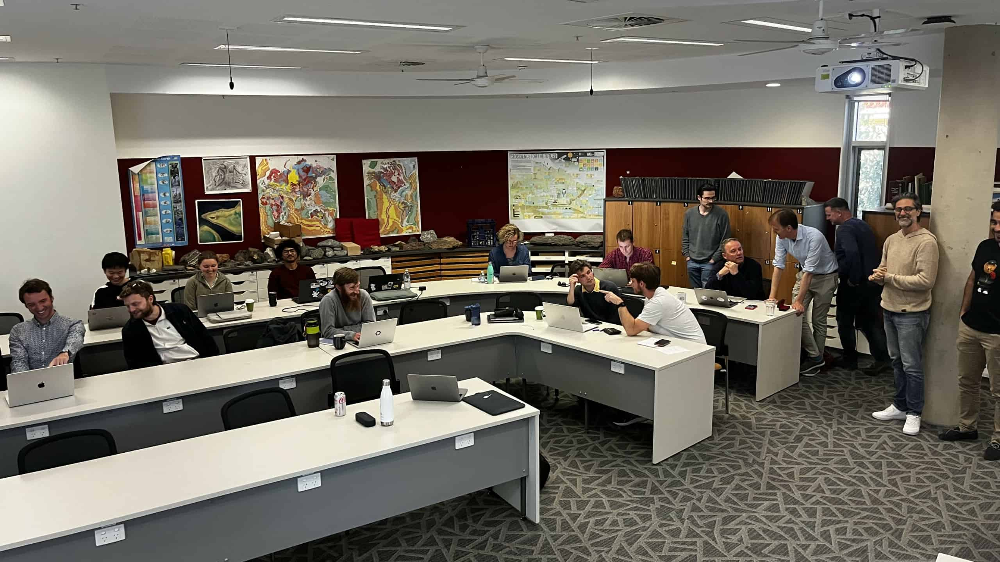
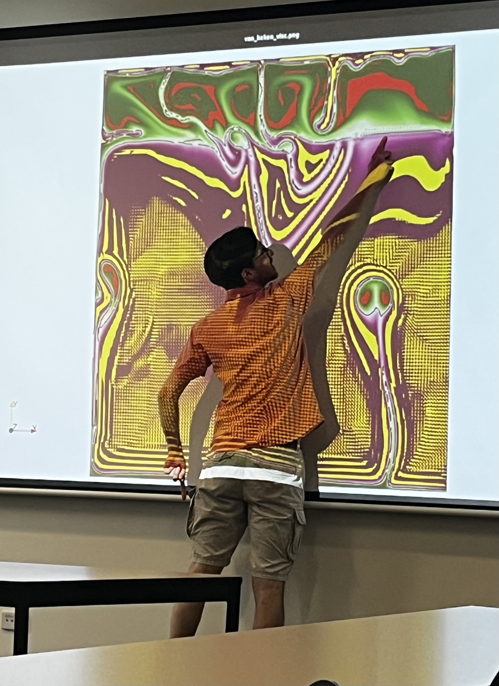
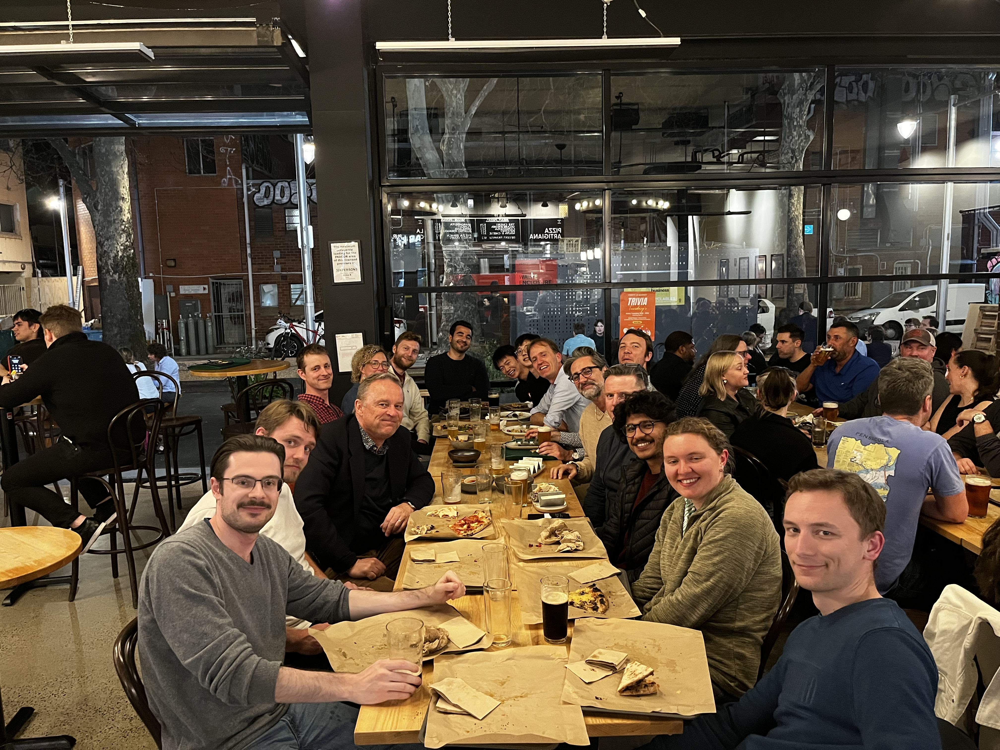
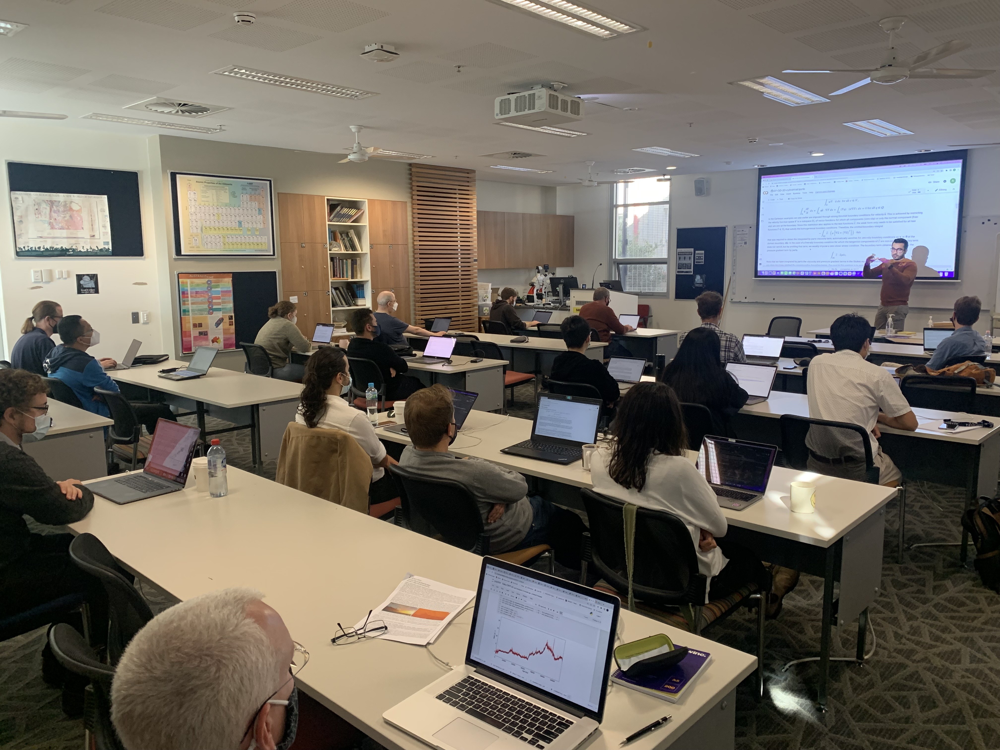
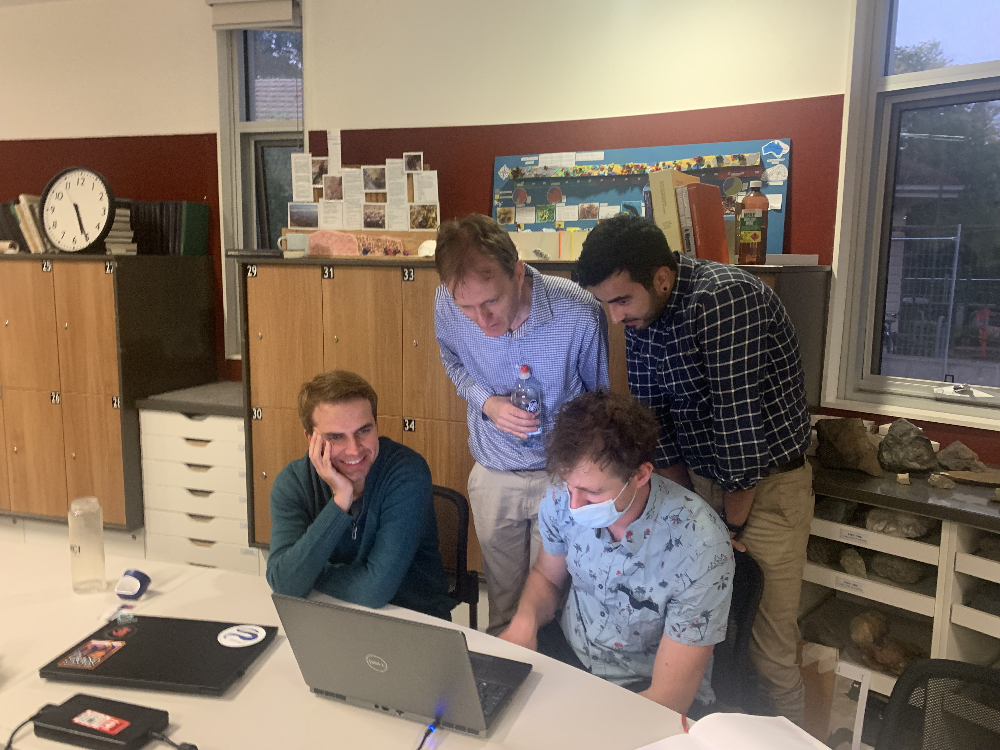
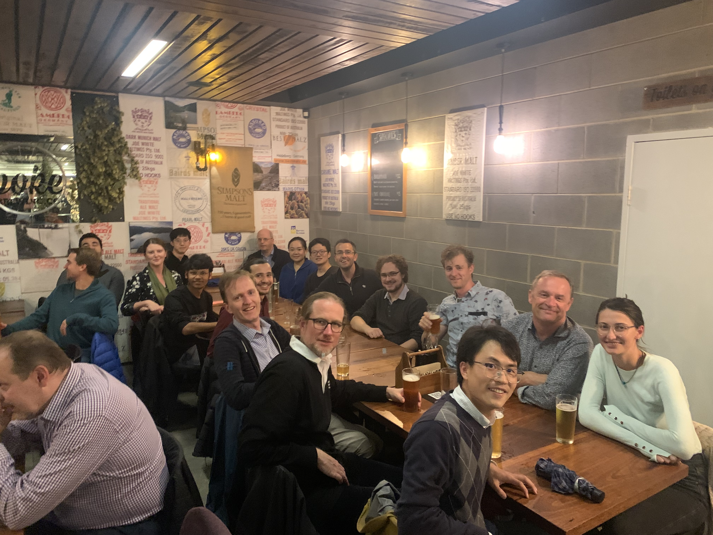

# Events and Media

## Workshops

### G-ADOPT Workshop 2024

The 2024 G-ADOPT workshop will be held away from the ANU, at the NSW south coast. Mark your diaries for 13/11/24-15/11/24. Further information to follow. 

### G-ADOPT Workshop 2023

{ align=centre width="200" }
{ align=centre width="200" }
{ align=centre width="200" }

The 2023 G-ADOPT workshop was held on 14/09-15/09 at the Australian National University. This in-person workshop provided an opportunity for the G-ADOPT team to showcase recent progress on the forward and adjoint components of this finite element modelling platform, using the Firedrake and dolfin-adjoint frameworks.

### G-ADOPT Workshop 2022

{ align=centre width="200" }
{ align=centre width="200" }
{ align=centre width="200" }

The first G-ADOPT workshop was help on 28/04/22-29/04/22 at the Australian National University. This workshop provided an opportunity for the G-ADOPT development team to showcase progress on the forward modelling component of our platform, using the Firedrake framework. The overarching goal of the workshop was to provide a background to the platform and training for potential users, thus facilitating community growth within Australia. Although our focus was on geodynamical application, we also identified other research areas for future applicability. There was an opportunity for interested practitioners to engage with developers and other participants, to ascertain whether their problems are tractable within Firedrake.

## Media and Outreach

Below are examples of recent blogs and media articles associated with the G-ADOPT platform.

1. EGU blog article (11/2022): [A next-generation computational modelling framework for geodynamics](https://blogs.egu.eu/divisions/gd/2022/11/21/g-adopt-a-next-generation-computational-modelling-framework-for-geodynamics).
2. ARDC Newsletter (02/2024): [A versatile tool for tackling grand challenges for Earth Sciences](https://ardc.edu.au/article/versatile-modelling-tool-to-help-tackle-grand-challenges-for-earth/).
