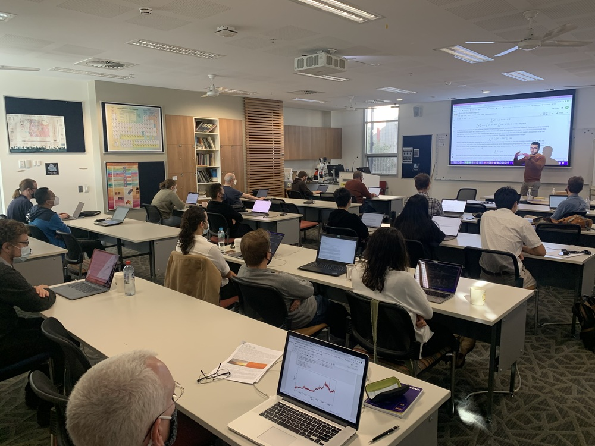
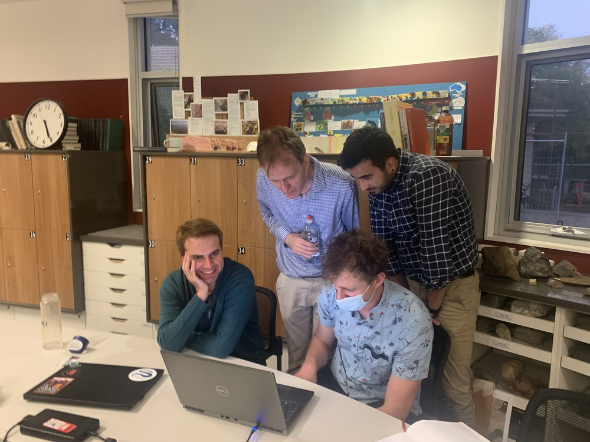
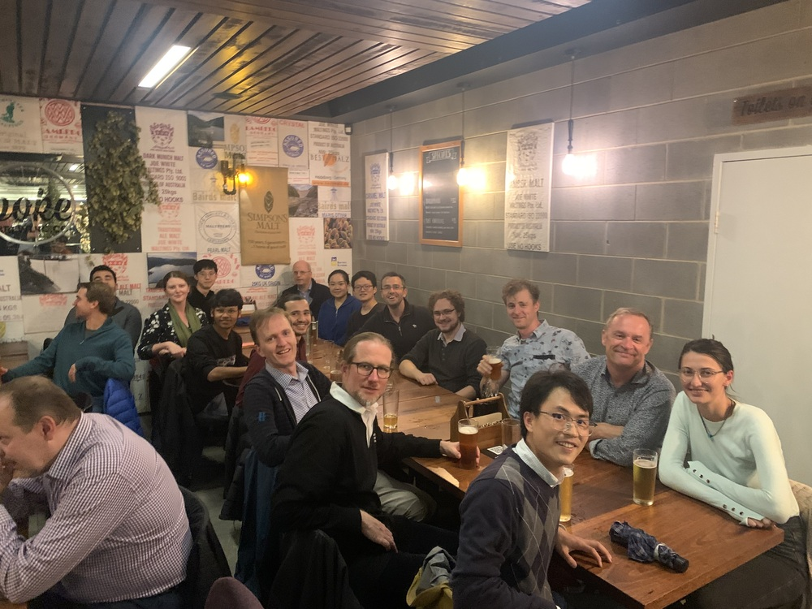

# G-ADOPT Workshop 2022

{ width="200" loading=lazy }
{ width="200" loading=lazy }
{ width="200" loading=lazy }

The first G-ADOPT workshop was held on 28/04/22-29/04/22 at the Australian National University. This workshop provided an opportunity for the G-ADOPT development team to showcase progress on the forward modelling component of our platform, using the Firedrake framework. The overarching goal of the workshop was to provide a background to the platform and training for potential users, thus facilitating community growth within Australia. Although our focus was on geodynamical application, we also identified other research areas for future applicability. There was an opportunity for interested practitioners to engage with developers and other participants to ascertain whether their problems are tractable within Firedrake.
