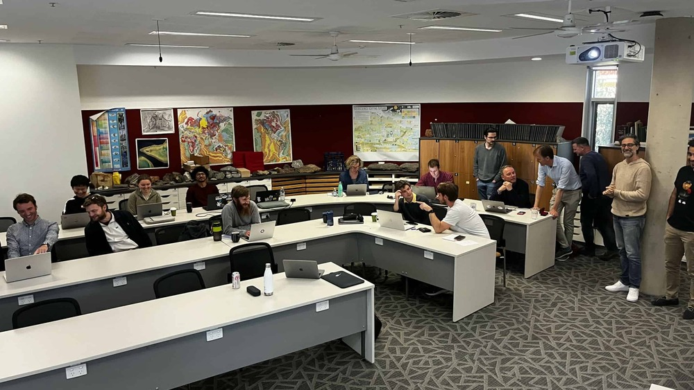
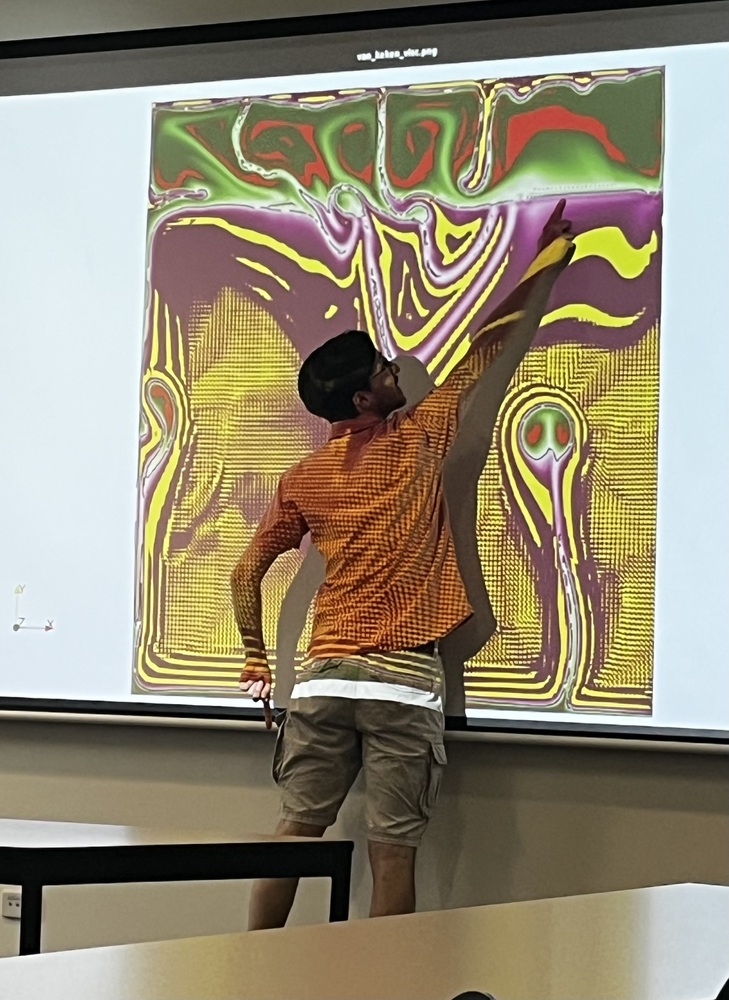
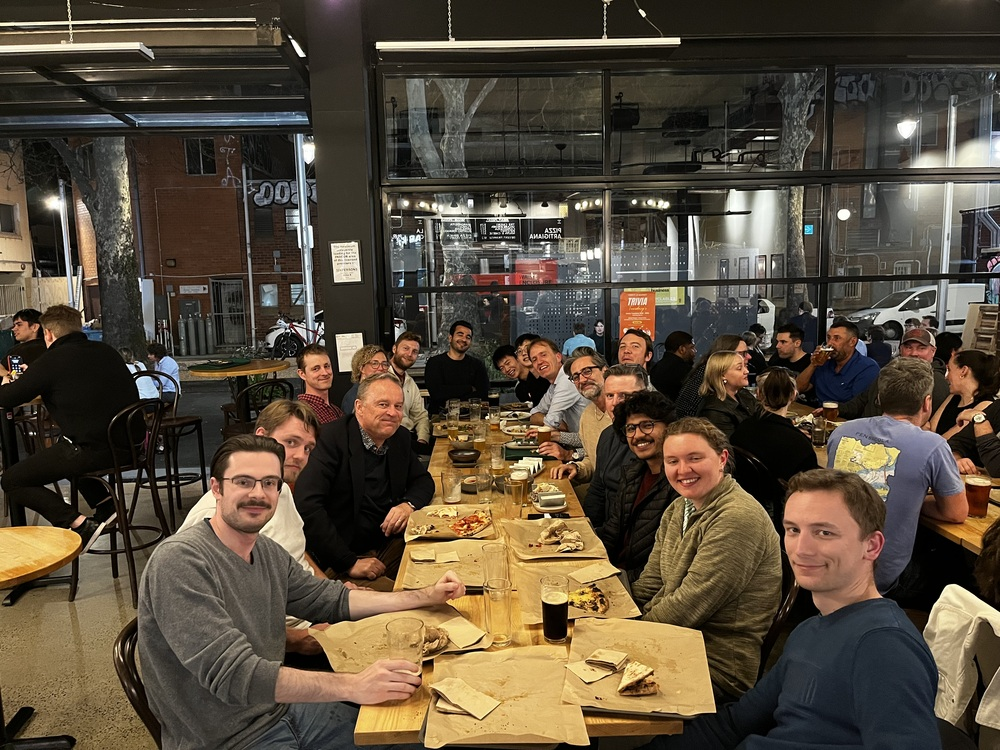

# G-ADOPT Workshop 2023

{ width="200" loading=lazy }
{ width="200" loading=lazy }
{ width="200" loading=lazy }

The 2023 G-ADOPT workshop was held on 14/09-15/09 at the Australian National University. This in-person workshop provided an opportunity for the G-ADOPT team to showcase recent progress on the forward and adjoint components of this finite element modelling platform, using the Firedrake and dolfin-adjoint frameworks.
