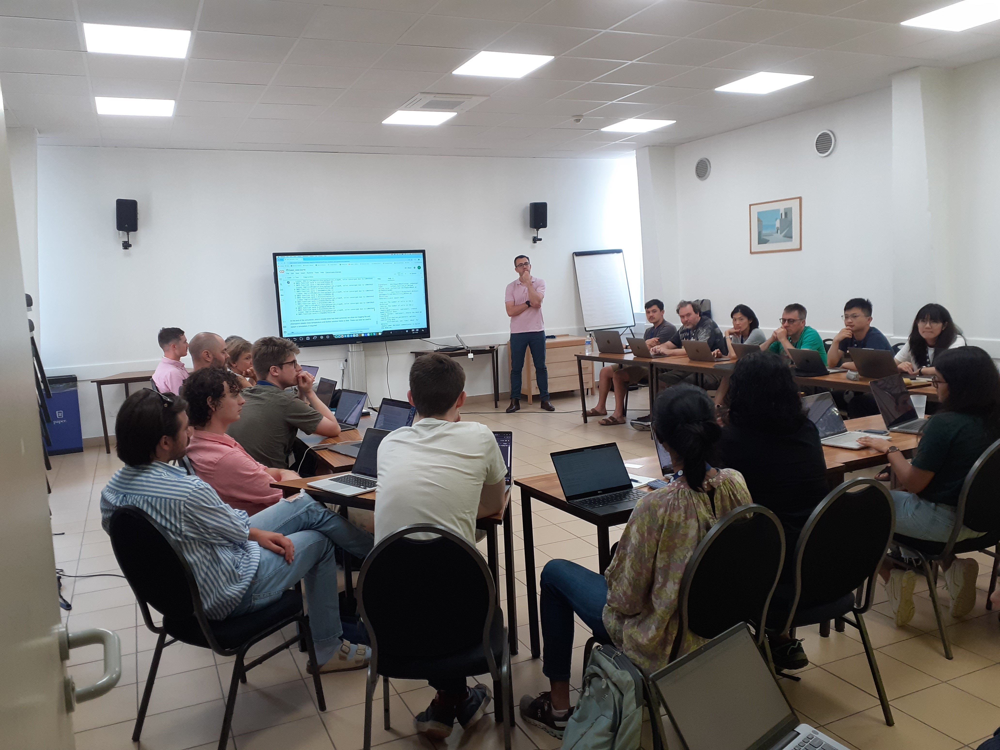

# G-ADOPT Workshop -- Sete, France, September 2024

{ width="200" loading=lazy }

The G-ADOPT team ran its first international workshop, as a part of the 2024 Ada Lovelace workshop on Modelling Mantle and Lithosphere Dynamics, in Sete, France. A number of tutorials were covered, ranging from idealised forward models, to adjoint-based inversions. The workshop was attended by over 30 participants. 