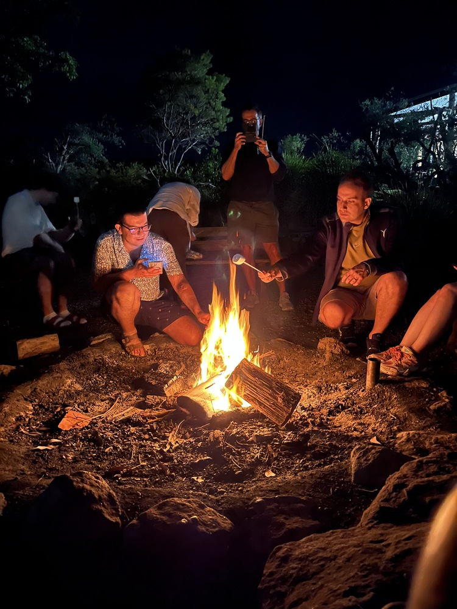

# G-ADOPT Workshop 2024

{: style="height:108px" loading=lazy }
{: style="height:108px" loading=lazy }
{: style="height:108px" loading=lazy }

The 2024 [AuScope](https://www.auscope.org.au/) supported G-ADOPT workshop was held at the [ANU's Kioloa Coastal Campus](https://www.anu.edu.au/about/campuses-facilities/kioloa-coastal-campus) on the New South Wales coast (10/11/24 - 12/11/24).

The workshop provided background to the platform and training for potential users, facilitating community growth. We welcomed national and international participants. Key areas of focus included:

1. Mantle and lithosphere dynamics;
2. Glacial isostatic adjustment and visco-elasticity;
3. Multi-material simulations;
4. Adjoint-based optimisation problems.
