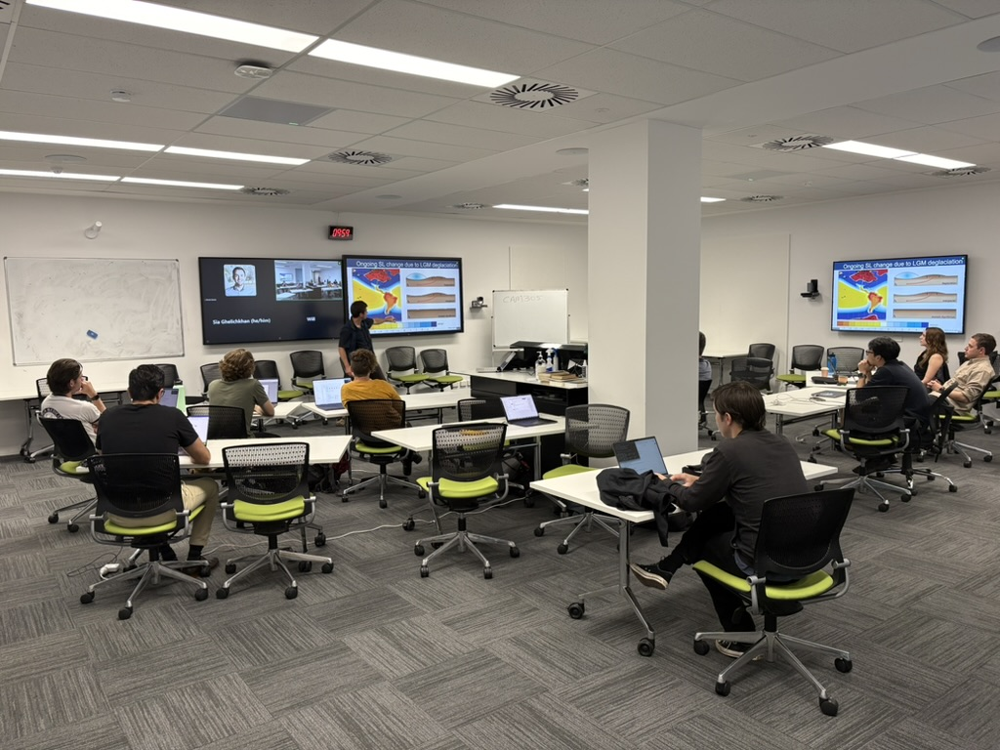
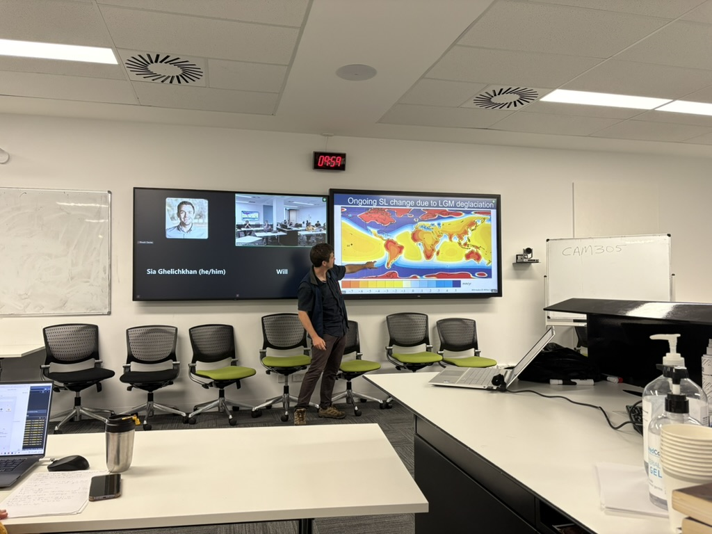

# GIA Workshop 2025

{: style="height:108px" loading=lazy }
{: style="height:108px" loading=lazy } group photo here

The G-ADOPT team held a workshop focused on Glacial Isostatic
Adjustment (GIA) at the University of Tasmania's Sandy Bay Campus
on **Tuesday 04/11/25** in the lead up to the ACEAS Research Forum.
The workshop provided an overview of G-ADOPT's forward and
adjoint-based inverse GIA modelling capabilities and
offered hands-on exercises throughout.
