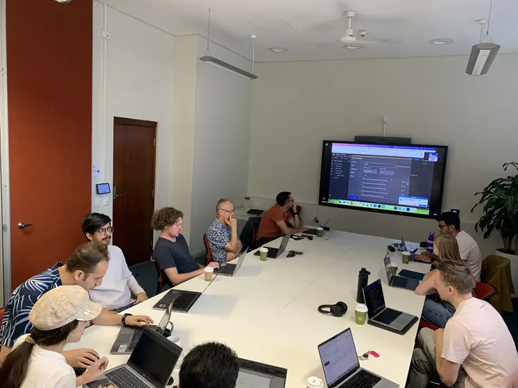

# G-ADOPT Presentations — March–May 2025

{: style="height:108px" loading=lazy }

**Sydney, Earthbyte group — 28 March 2025**
Rhodri Davies and Sia Ghelichkhan visited the Earthbyte group at the University of
Sydney. They presented recent developments targetting global geodynamical models and
their interaction with plate-reconstruction frameworks, such as GPlates.

**Paris, IPGP — 09 May 2025**
Thomas Duvernay visited IPGP and gave an overview of Firedrake and G-ADOPT to institute
members. The presentation included an introduction with hands-on examples of
Firedrake-based simulations and discussed most of the recent G-ADOPT developments. The
objective was to provide an as-complete-as-possible first look of Firedrake and G-ADOPT
to potential new users.

**Zurich, ETH — 09 May 2025**
Sia Ghelichkhan visited ETH Zurich.