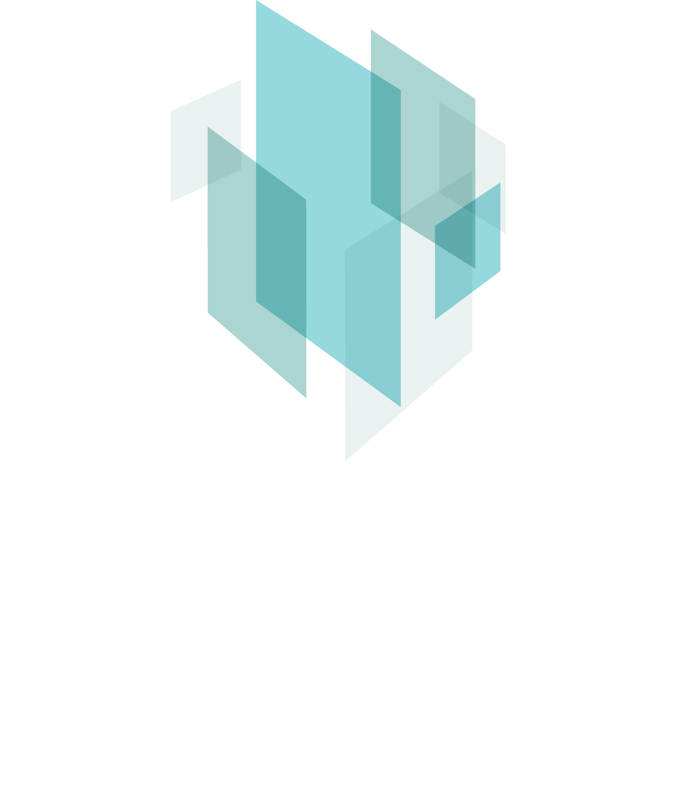

# Funding and Partners

## Background
G-ADOPT was initiated and funded within the Australian Research Data Commons (ARDC) [2020 platforms call](https://doi.org/10.47486/PL031), which invested in platforms that would transform the way research is conducted in various disciplines. G-ADOPT is short for ‘Geoscientific ADjoint Optimization PlaTform’. At first, though, the ‘G’ stood for ‘Geodynamic’ when the platform had a tighter focus. G-ADOPT is now applied across many branches of geosciences, including groundwater simulation, optimisation for renewable energy generation, and simulating the solid Earth's response to melting polar ice sheets. In 2023, the platform received funding from AuScope, to focus, in particular, on the latter challenge.

## Specific Funding Awards and Grants

1. **ARDC Platform Grant (2020)** - Geodynamic ADjoint Optimization PlaTform (PL031).  
**Funding**: $1,355,492.  
**Purpose**: To develop transformational new research software infrasturcutre for inverse geodynamical simulation.  
**CIs**: D. R. Davies (ANU), S. Ghelichkhan (ANU), K. Czarnota (GA), D. Müller (USyd), S. C. Kramer (Imperial College London), D. Ham (Imperial College London), S. Funke (Simula Research Laboratories), P. E. Farrell (Oxford University), M. Sambridge (ANU), M. Seton (USyd), S. D. B. Goes (Imperial College London), B. Evans (NCI), T. Rawling (AuScope).  

2. **AuScope 2023 NCRIS Research Infrastructure Investment Plan (RIIP) - Coastal Research Infrastructure (CoastRI)**.  
**Funding**: $1,418,350.  
**Purpose**: To support development and maintenance of G-ADOPT’s research software infrastructure for simulating Glacial Isostatic Adjustment (GIA) and solid Earth impacts on sea level (for example, through dynamic topography).  
**CIs**: D. R. Davies (ANU), M. J. Hoggard (ANU), S. Ghelichkhan (ANU), S. C. Kramer (Imperial College London), A. Gibson (ANU), A. Hogg (ACCESS-NRI),  T. Rawling (AuScope). 

## Partners
The Australian Research Data Commons (ARDC) is a transformational initiative that enables Australian research community and industry access to nationally significant, leading edge data intensive einfrastructure, platforms, skills and collections of high-quality data. In partnerships with organisations, the ARDC leads facilitations that work towards a coherent research environment to enable researchers to find, access, contribute to and effectively use services to maximise research quality and impact. The ARDC is funded by the Australian Government's National Collaborative Research Infrastructure Strategy (NCRIS).

<figure markdown="span">
  { align=left, width="200" }
  <figcaption>Image caption</figcaption>
</figure>

AuScope provides geoscientists with a world-class research ‘toolkit’ to help tackle Australia’s key geoscience challenges and improve Australian life and the environment. AuScope is funded by the Australian Government's National Collaborative Research Infrastructure Strategy (NCRIS).

The National Computational Infrastructure (NCI) is Australia’s leading high-performance data, storage and computing organisation, providing expert services to benefit all domains of science, government and industry. NCI brings the Australian Government and the Australian research sector together through a broad collaboration involving the largest national science agencies, universities, industry and the Australian Research Council. NCI is supported by the Australian Government's National Collaborative Research Infrastructure Strategy (NCRIS)

The Australian Earth-System Simulator (ACCESS-NRI) is a national research Infrastructure created to support development and research with the Australian Community Climate and Earth System Simulator (ACCESS) modelling system framework. ACCESS simulates past, present and future climate, weather and Earth-Systems.

Geoscience Australia is Australia's pre-eminent public sector geoscience organisation. They are the nation's trusted advisor on the geology and geography of Australia. They apply science and technology to describe and understand the Earth for the benefit of Australia.

The Australian Research Council's purpose is to `grow knowledge and innovation for the benefit of the Australian community through funding the highest quality research, assessing the quality, engagement and impact of research, and providing advice on research matters'.

The consequences of changes in the Antarctic, including sea-level rise, extreme weather events, alterations to rainfall patterns, and fisheries impacts, will be profoundly costly to Australia. However, the speed and scale of future change remains poorly understood. The Australian Centre of Excellence in Antarctic Sciences (ACEAS) will combine new field data with innovative models to revolutionise predictions of the future of the East Antarctic and Southern Ocean.

