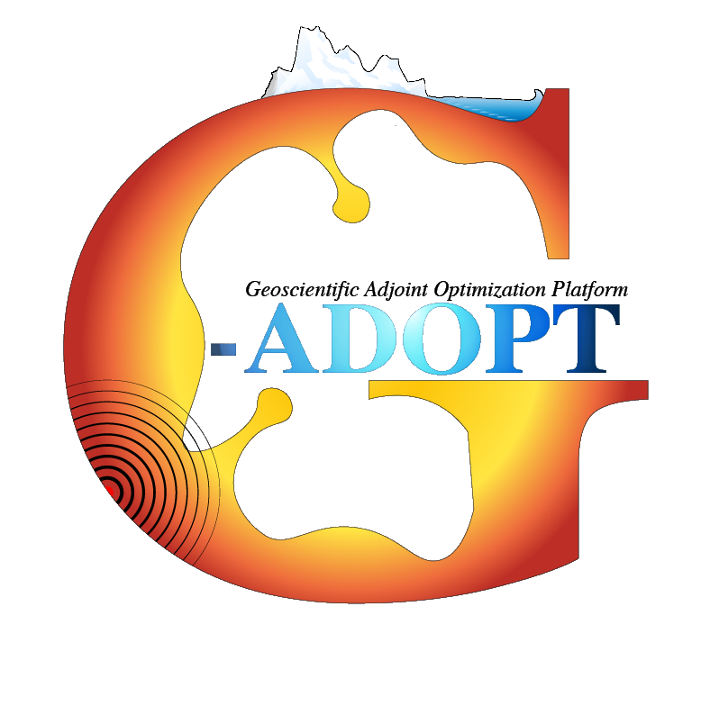

---
hide:
  - navigation
---

# Welcome to the homepage for G-ADOPT

**The Geoscientific Adjoint Optimisation PlaTform (G-ADOPT)** is a computational platform for simulating geoscientific flows, being developed and maintained by researchers from the [Research School of Earth Sciences](https://earthsciences.anu.edu.au/) at the [Australian National University (ANU)](https://www.anu.edu.au/).

It is underpinned by several novel software libraries:  
1. [Firedrake](https://www.firedrakeproject.org/): an automated system for solving partial differential equations using the finite element method. Using a high-level language ([Unified Form Language - UFL](https://fenics.readthedocs.io/projects/ufl/en/latest/manual/introduction.html)) that reflects the mathematical description of the governing equations, the user specifies the finite element problem symbolically. The high-performance implementation of assembly operations for the discrete operators is then generated `automatically' by a sequence of specialised compiler passes that apply symbolic mathematical transformations to the input equations to ultimately produce C (and C++) code. Firedrake compiles and executes this code to create linear or nonlinear systems, which are solved by [PETSc](https://petsc.org/release/). In comparison with conventional finite element libraries, and even more so with handwritten code, Firedrake provides a higher productivity mechanism for solving finite element problems whilst simultaneously applying sophisticated performance optimisations that few users would have the resources to code by hand.  
2. [dolfin-adjoint](https://github.com/dolfin-adjoint/pyadjoint): automatically derives the corresponding representation of discrete adjoint equations in a form compatible with Firedrake, providing highly-optimised forward and adjoint models.  
3. [Rapid Optimisation Library (ROL)](https://trilinos.github.io/rol.html): a package for large-scale optimization. It is used for the solution of optimal design, optimal control and inverse problems in large-scale engineering applications. Other uses include mesh optimization and image processing.  
Each of these leading-edge libraries are developed and supported by large national and international teams.    

Building on the concepts of composable abstraction and automatic code generation techniques, G-ADOPT aims to provide accurate, efficient, flexible, easily extensible, scalable, transparent, and reproducible open-source research software for (forward and inverse) data-driven geoscientific simulations. Current application areas include geodynamics, glacial isostatic adjustment (GIA), groundwater and renewable energy optimisation.

## How to use this site

*Thermal structure predicted from a global mantle convection simulation in G-ADOPT, where the geographic distribution of heterogeneity is dictated by 230 Myr of imposed plate motion history from [GPlates](https://www.gplates.org/). Each image includes a radial surface immediately above the core-mantle boundary, a cross-section, and transparent isosurfaces at temperature anomalies (i.e. away from the radial average) of T=-0.075 (blue) and T=0.075 (red), highlighting the location of downwelling slabs and upwelling mantle plumes, respectively. Continental boundaries provide geographic reference. The animation provides an Africa-centered view.*
