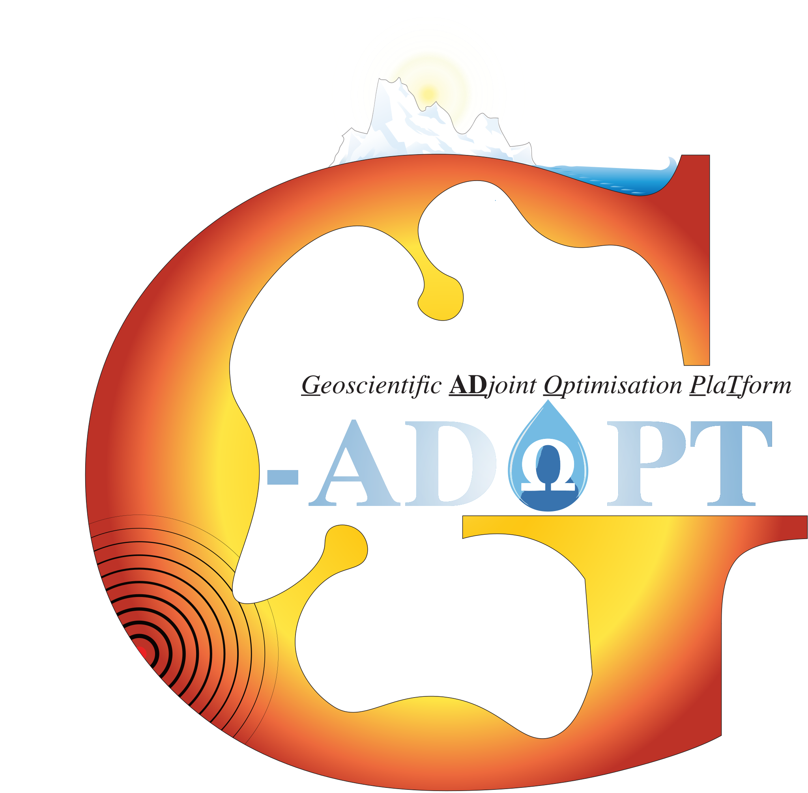

# Welcome to the homepage for G-ADOPT

{ align=right width="400" }
**The Geoscientific ADjoint Optimisation PlaTform (G-ADOPT)** is a next-generation computational platform for simulating geoscientific flows. It is being developed and maintained by researchers from the [Research School of Earth Sciences](https://earthsciences.anu.edu.au/) at the [Australian National University (ANU)](https://www.anu.edu.au/), alongside international partners.

Building on composable abstraction and automatic code generation techniques, G-ADOPT provides accurate, efficient, flexible, easily extensible, scalable, transparent, and reproducible open-source research software for (forward and inverse) data-driven geoscientific simulations.

Areas of current application include:

1. **Geodynamics**, with a particular emphasis on simulating mantle dynamics and its diverse surface manifestations;
2. **Glacial Isostatic Adjustment (GIA)**, the ongoing response of Earth's surface and sea level to changes in ice and water loading as Earth moves into and out of periods of glaciation — in conjunction with the [Australian Centre for Excellence in Antarctic Science](https://antarctic.org.au/);
3. **Groundwater**, focussing on predicting the evolution of water storage in Australia — in conjunction with the [ANU Institute for Water Futures](https://waterfutures.anu.edu.au/).

---

<figure markdown>
<iframe width="800" height="315" frameBorder="0" src="static/viewer.html"></iframe>
<figcaption markdown>
Present-day thermal structure predicted from a global mantle convection simulation in G-ADOPT that incorporates 230 Myr of plate motion history reconstructed in [GPlates](https://www.gplates.org/). This interactive animation includes a background cross-section, a radial surface immediately above the core-mantle boundary, and isosurfaces at temperature anomalies (i.e. away from the radial average) of T=-0.075 (blue) and T=0.075 (red), highlighting the location of downwelling slabs and upwelling mantle plumes, respectively. Continental boundaries provide a geographic reference.
</figcaption>
</figure>

---

{ width="200" }

{ width="200" }

{ width="200" }

{ width="200" vertical-align="middle" }

