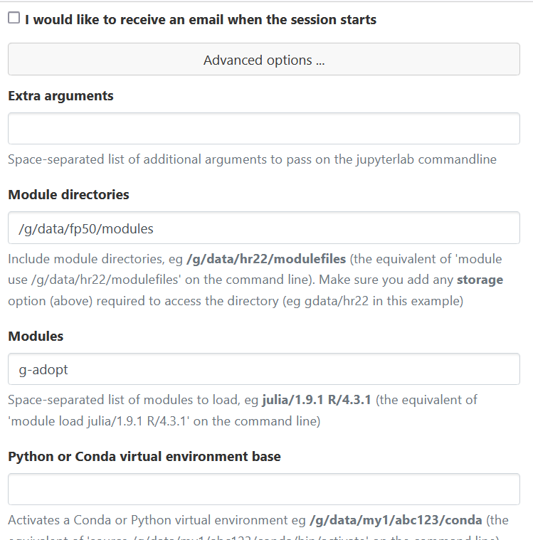

# Installing the G-ADOPT library

First of all, you need to install [Firedrake](https://www.firedrakeproject.org), the finite element framework underpinning G-ADOPT.
Firedrake is available for Ubuntu, Mac, and, in principle, other Linux and Linux-like systems.

You can install both Firedrake and G-ADOPT by running:

    curl -O https://raw.githubusercontent.com/firedrakeproject/firedrake/master/scripts/firedrake-install
    python3 firedrake-install --install gadopt

More detailed instructions for installing Firedrake and suggestions for troubleshooting can be found
on the [Download](https://www.firedrakeproject.org/download.html) page of the Firedrake website. Note that the install procedure may take
up to one hour depending on your system.

## Using the G-ADOPT library

If you would like to run G-ADOPT through scripts or interactively, simply
ensure that your Firedrake environment is activated:

    source firedrake/bin/activate

Furthermore, the `gadopt` Python module should be available for you to use.

## Run the tutorials

The [G-ADOPT tutorials](tutorials/index.md) are located within the [G-ADOPT
GitHub repository](https://github.com/g-adopt/g-adopt). If you would
like to experiment with them, there are a few more requirements for
your Firedrake environment.

First, activate the Firedrake environment so that the requirements
will be installed into it:

    source firedrake/bin/activate

Next, install Jupyter Notebook and the optional G-ADOPT requirements:

    python3 -m pip install notebook gadopt[demos]

Finally, clone the G-ADOPT repository to access the demos:

    git clone https://github.com/g-adopt/g-adopt

Now you should be ready to test the installation and run the first
tutorial! Start the notebook server:

    jupyter notebook

Within the browser window that pops up, you can browse to the
`g-adopt/demos` directory and open any Python script with the `.py`
extension as a notebook.

The tutorials can also be run in the JupyterLab environment on the ARE
after following the above instructions.

## Visualisation software

Firedrake can output data in VTK format, suitable for viewing in [Paraview](https://www.paraview.org/).
On Ubuntu and similar systems, you can obtain Paraview by installing the paraview package. On Mac OS the
easiest approach is to download a binary from the paraview website.

## Optional install

To bring in the optional nonlinear optimisation dependencies you should activate the virtual environment of an existing Firedrake installation
and then install the optimisation variant:

    pip install gadopt[optimisation]

## Using the G-ADOPT library on Gadi

The G-ADOPT team maintains an up-to-date G-ADOPT and Firedrake installation
with all optional dependencies on NCI's Gadi HPC system. To use G-ADOPT on 
Gadi, create an NCI account, then follow 
[this link](https://my.nci.org.au/mancini/project/fp50/join) to request to 
join the fp50 project. Once your request is approved, you can
access G-ADOPT on Gadi by running:

    module use /g/data/fp50/modules
    module load g-adopt

To use G-ADOPT in your batch scripts, you'll need to add the following to your
PBS flags:

    -lstorage=gdata/fp50

By default, this will give you the latest release of G-ADOPT, and load the
most recent `firedrake` module. If you wish to use your own G-ADOPT installation, set
the environment variable `MY_GADOPT` and load the firedrake module.

    export MY_GADOPT=/g/data/ab12/path/to/my/gadopt
    module use /g/data/fp50/modules
    module load firedrake

You can also use G-ADOPT in a JupyterLab session on the
[ARE](https://opus.nci.org.au/spaces/Help/pages/162431120/ARE+User+Guide) at 
NCI. When launching a JupyterLab session, add `gdata/fp50` to the storage 
field and the following in the 'Advanced options' section:

{: style="width:450px"}

To run the demos on the ARE, untar the `demos.tgz` file found in `/g/data/fp50/apps/firedrake/gadopt`
into your `/scratch` directory. Once the ARE session has started, navigate to one of the demo
directories, right click on the `.py` file and select Open With -> Notebook

{ : style="width:450px"}

The demos can also be run in parallel on the standard job queues. For example, the following 
script, when placed in the `mantle_convection/3d_spherical` directory will run that demo on 4
cores in Gadi's 'normal' queue:
``` sh title="run_gadi.sh"
#!/usr/bin/env bash
#PBS -lncpus=4
#PBS -lmem=16GB
#PBS -lwalltime=00:15:00
#PBS -lstorage=gdata/fp50
#PBS -ljobfs=10GB
#PBS -lwd
#PBS -qnormal

module use /g/data/fp50/modules
module load g-adopt

mpiexec python3 3d_spherical.py
```

## Developing G-ADOPT

If you are keen to make changes to the core G-ADOPT code (and you want to work in a separate directory to Firedrake's default location for G-ADOPT), you should first clone the [G-ADOPT GitHub repository](https://github.com/g-adopt/g-adopt):

    git clone https://github.com/g-adopt/g-adopt.git

After activating the virtual environment of an existing Firedrake installation, you can then install G-ADOPT with:

    pip install -e g-adopt/

The editable, `-e`, flag means that any updates you make to this directory will be reflected directly in the Firedrake virtual environment.
