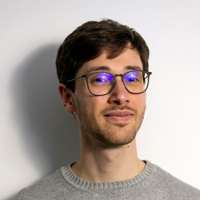

# Our team

## Leadership

<figure class="bio" markdown>
{ width="300" }
<figcaption markdown>### [Rhodri Davies](https://earthsciences.anu.edu.au/professor-rhodri-davies)
#### Project Lead

---

Rhodri is a Professor of computational and observational geodynamics at the ANU's Research School of Earth Sciences. He is recognised for developing and integrating state-of-the-art tools that simulate mantle and lithosphere dynamics with a diverse range of observational datasets. His long-term vision is to develop a new paradigm for solid Earth evolution with the overarching goal of reconstructing the thermo-chemical structure and flow history of Earth’s mantle and its evolution through space and time (4-D), across spatial and temporal scales.   
</figcaption>
</figure>

<figure class="bio" markdown>
{ width="300" }
<figcaption markdown>### [Sia Ghelichkhan](https://earthsciences.anu.edu.au/people/academics/dr-sia-ghelichkhan) 
#### Lead Investigator

---

Sia is a tenure-track research fellow at the Research School of Earth Sciences, ANU, and is affiliated with the Institute for Water Futures at ANU. His primary research interest lies in inverse modeling of Earth system processes, particularly in groundwater and mantle convection. Sia's work addresses the fundamental challenge of establishing digital twins for continental-scale groundwater systems in Australia and Earth's mantle, both spatially and temporally.
</figcaption>
</figure>

<figure class="bio" markdown>
{ width="300" }
<figcaption markdown>### [Stephan Kramer](https://www.imperial.ac.uk/people/s.kramer) 
#### International Software Development Coordinator

---

Stephan is a research felllow at the department of Earth Science and Engineering at Imperial College London. He is an expert in the development of tools integrating state of the art numerical and computational techniques that enable cutting edge research in a variety of fields within the Earth Sciences, ranging from geodynamics to coastal oceanography. One of his key interests is the combination of modern automatic programming approaches and adjoint techniques to solve PDE-constrained inversion and optimisation problems.
</figcaption>
</figure>

<figure class="bio" markdown>
{ width="300" }
<figcaption markdown>### [Angus Gibson](https://github.com/angus-g)
#### Technical Lead

---

Angus is a research software engineer at the Research School of Earth Sciences at the ANU. His key interest is in synthesising the need for high performance computing with the demands of science, in the fields of geodynamics and geophysical fluid dynamics. This happens through the development, maintenance and support of tools for modelling and analysis, and optimisation of models to run efficiently on current and future supercomputers.
</figcaption>
</figure>

## Core Developers

<figure class="bio" markdown>
{ width="300" }
<figcaption markdown>### [Thomas Duvernay](https://researchers.anu.edu.au/researchers/duvernay-t?term=languages) 
#### Multi-material Approaches

---

Thomas is a postdoctoral fellow at the Research School of Earth Sciences, Australian National University. He is an enthusiastic geodynamicist passionate about mantle convection and its link to several processes at Earth's surface, such as volcanism. His prime interest lies in dynamical mechanisms at the root of intra-plate volcanism and mid-ocean ridges. Thomas's overarching goal is to improve our understanding of the physical and chemical processes controlling our planet's magmatic activity.
</figcaption>
</figure>

<figure class="bio" markdown>
{ width="300" }
<figcaption markdown>### [David Ham](https://www.imperial.ac.uk/people/david.ham) 
#### Firedrake

---

David is a Professor in Computational Mathematics at Imperial College London, Department of Mathematics. He leads the Firedrake project, a large project on the automatic generation of scientific models for multiple different massively parallel architectures from a single high-level mathematical specification in a domain specific language.
</figcaption>
</figure>

<figure class="bio" markdown>
{ width="300" }
<figcaption markdown>### [Will Scott](https://researchers.anu.edu.au/researchers/scott-w)
#### Glacial Isostatic Adjustment

---

Will is a computational geoscientist at the ANU's Research School of Earth Sciences, funded as a post-doctoral researcher by the Australian Centre for Excellence for Antarctic Science (ACEAS). Will's focus is on developing next generation (forward and inverse) finite element models to better understand polar contributions to sea level change. Before joining ANU he developed a new model for ocean flow under ice shelf cavities in Antarctica using the Firedrake finite element framework. At ANU he is working as part of a cross-disciplinary team to develop a 'state-of-the-art' Glacial Isostatic Adjustment (GIA) model to reduce uncertainty in sea level projections.
</figcaption>
</figure>

## Scientific Advisors

<figure class="bio" markdown>
{ width="300" }
<figcaption markdown>### [Mark Hoggard](https://mjhoggard.com/)
#### G-ADOPT Focus: Glacial Isostatic Adjustment

---

Mark is a Discovery Early Career Research Fellow ([DECRA](https://www.arc.gov.au/funding-research/funding-schemes/discovery-program/discovery-early-career-researcher-award-decra)) at the ANU's Research School of Earth Sciences. His research program is generally problem-orientated and therefore spans a wide range of topics, crossing the traditional discipline boundaries of Earth sciences. It brings together data and models from across seismology, rock physics, geochemistry, sedimentology, geochronology, geomorphology and paleoclimate. It combines field observations, numerical modelling, high-performance computing, uncertainty propagation and statistics. Mark generally tries to take an inverse approach to solving problems, whereby observational datasets are used to place constraints on unknown physical properties and parameters of the Earth. 
</figcaption>
</figure>

<figure class="bio" markdown>
{ width="300" }
<figcaption markdown>### [Matt King](https://discover.utas.edu.au/Matt.King)
#### G-ADOPT Focus: Glacial Isostatic Adjustment

---

Matt is Professor of polar geodesy at the University of Tasmania. Since 2021, he has been Director of the [Australian Centre for Excellence in Antarctic Science](https://antarctic.org.au/). His research focusses on solid earth geophysics and geodesy, with a particular focus on Antarctica. Matt focuses on the use of geodetic tools to solve problems related to Earth geophysics, notably Earth deformation due to glacier melt, earthquakes, and tides; sea-level change; and polar ice mass balance. He also seeks to advance the accuracy and precision of those geodetic tools (e.g., Global Navigation Satellite Systems (GNSS/GPS) and satellite gravimetry (GRACE).
</figcaption>
</figure>

<figure class="bio" markdown>
{ width="300" }
<figcaption markdown>### [Dietmar Müller](https://www.sydney.edu.au/science/about/our-people/academic-staff/dietmar-muller.html)
#### G-ADOPT Focus: 4-D Reconstructions of Earth's Mantle and its Impact at Earth's Surface

---

Dietmar is a Professor of Geophysics at the University of Sydney's School of Geosciences. He leads the [EarthByte](https://www.earthbyte.org/) research group, which is known for pursuing open innovation, involving the collaborative development of open-source paleogeographic information system software as well as global digital data sets made available under a creative commons license. One of the fundamental aims of the EarthByte Group is geodata synthesis through space and time, assimilating the wealth of disparate geological and geophysical data into 4-D (space-time) Earth models. His research interests include plate tectonics, geodynamics, paleogeography with a focus on ocean basin evolution, deep Earth resource exploration, basin structure and evolution including groundwater resources, the deep carbon cycle, applications of satellite imaging, and applying machine learning approaches to problems of sparse, complex geodata.
</figcaption>
</figure>

<figure class="bio" markdown>
{ width="300" }
<figcaption markdown>### [Maria Seton](https://www.sydney.edu.au/science/about/our-people/academic-staff/maria-seton.html)
#### G-ADOPT Focus: Plate Tectonic Reconstructions and Intraplate Volcanism

---

Maria is an Associate Professor at the University of Sydney's School of Geosciences. Maria's research largely focusses on using our knowledge of surface plate kinematics and the marine geological record to understand processes in the deep earth, how the deep Earth communicates with the surface and the influence of tectonics on Earth's long-term climate evolution. While much of her research is global in scale and scope, she has a particular interest in the tectonic, geodynamic and climatic evolution of the SW Pacific and Zealandia.
</figcaption>
</figure>

## Other Contributors

<figure class="bio" markdown>
{ width="300" }
<figcaption markdown>### [Ruby Turner](https://earthsciences.anu.edu.au/people/students/ruby-turner) 
#### PhD Student
#### Research School of Earth Sciences, ANU

---

Ruby is interested in multi-disciplinary approaches to modelling and understanding the dynamics of Earth's mantle. In particular, Ruby’s research centres on utilising the geochemistry of intraplate basalts to inform reconstructions of the mantle’s evolution and history.
</figcaption>
</figure>

