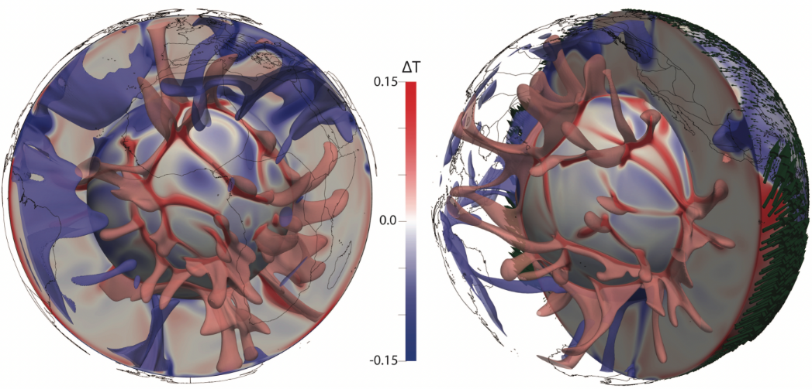

# Mantle Convection

{ align=center width="800" }

**From simple box models to global spherical simulations like the one above - learn to simulate mantle convection step by step.**

The diagram below shows the suite of G-ADOPT notebook tutorials for
mantle convection, and how they build on one another. Together, these
tutorials demonstrate how to set up and run both forward and inverse
mantle dynamics simulations using G-ADOPT.

```mermaid
--8<-- "docs/tutorials/mantle_convection/.diagram.mermaid"
```

Our tutorials take you on a journey from the simplest
model setups to advanced, Earth-like simulations. Starting with a basic
2D convection model (isoviscous, incompressible), you will gradually
explore more realistic physics, new boundary conditions, 3D and spherical
geometries, and even link your models to plate reconstructions with GPlates.

Along the way, you will also discover how to analyse key surface signals
such as dynamic topography and learn how to use G-ADOPT's powerful adjoint
tools to recover unknown conditions from data.

After completing these tutorials, you will be equipped to:

1. Build forward mantle convection models from simple boxes to full spherical shells.
2. Incorporate realistic physics such as visco-plastic rheology and compressibility.
3. Apply boundary conditions including free surfaces and reconstructed plate motions.
4. Compute and interpret dynamic topography.
5. Use adjoint methods to invert for unknown initial conditions.

Whether you are new to mantle dynamics or ready to tackle state-of-the-art research problems,
these tutorials provide a clear step-by-step path into mantle convection modelling with G-ADOPT.
